# Rapport-de-Stage-Epitech
Repport de Stage Epitech Tek1 fait en MarkDown.

--------------------------------------------------------

@import "style/styles symexo.less"

Jules de Rus
Tek 2

# Rapport de Stage - Symexo Balma

<center style="color: rgb(194, 194, 194)"><b>Participation aux projets internes de transformation numérique chez SYMEXO</b><br>
Stage de deuxième année<br>15 Juillet 2024 - 13 Décembre 2024<center>

{width="50%" style="display: block; margin: 0 auto"}

{style="display: block; margin: 0 auto"}

<center style="color: rgb(194, 194, 194)"><br><br> Symexo <br> 2 rue André Citroën <br> 31130 Balma </center>

## Sommaire

- Présentation de la société et des Projets
  - [Un peu de contexte...](#Contexte)
    - [Symexo](#Symexo)
      - [Services](#Services)
      - [Hiérarchie](#Hierarchie)
      - [Exemples de Projets](#ExemplesProjets)
  - [Mes mission...](#MaMission)
    - [Refonte de l'espace client Symexo](#RefonteEspaceClient)
    - [Modèles de notifications](#ModelesNotifications)
      - [Interface GLPI](#InterfaceGLPI)
      - [Modèles](#Modeles)
    - [Génération et valorisation automatique de Documents](#GenerationDocuments)
      - [Logiciels Préalables](#LogicielsPrealables)
      - [Logiciels Principaux](#LogicielsPrincipaux)
      - [Déroulement de l'installation](#DeroulementInstallation)
        - [Machine Virtuelle](#VM)
        - [Docker](#Docker)
        - [Portainer](#Portainer)
        - [Gitea](#Gitea)
        - [Gitea Actions](#GiteaActions)
        - [SonarQube](#SonarQube)
        - [Sonatype Nexus Repository Manager](#Nexus)
      - [Après installation](#ApresInstallation)
        - [Workflow Gitea](#Workflow)
        - [Fonctionnement de l'écosystème](#FonctionnementEcosysteme)
        - [Problèmes rencontrés](#ProblemesUsineV2)
      - [Conclusions](#ConclusionUsineV2)
    - [Autres missions](#AutresMissions)
      - UNAPEI 60
      - Bug Note de Frais

<a name="Contexte"></a>

## Un peu de contexte…

<a name="Symexo"></a>

### Symexo

Dans le cadre de mon stage j’ai pu intégrer **Symexo Balma**, cette entreprise dont le siège social se trouve à Balma et qui est située aussi à Montpellier, Paris, Beauvais, Angers Poitiers, Niort, Cahors, Foix, Chalon-Sur-Saône, Nantes, Rodez, Bordeaux et Metz, est **spécialisée dans l’infogérance** : l’infogérance consiste à gérer les tâches informatiques confiées par une entreprise à un prestataire extérieur, ici, c’est Symexo. Mais Symexo s’occupe aussi d’**équiper ses clients** en matériel informatique tout en **les infogérant** et leur offrant un **support de qualité** ; tout ceci en restant le plus sobre numériquement et écologiquement.
<a name="Services"></a>

### Services

Dans cette entreprise, nous sommes divisés en **différents services** allant des services d’**Entretien et de Support**, jusqu’au service de **Commerce et Marketing** en passant par la **Cybersécurité** et la **Gestion de Projet** et bien plus encore. A ces services viennent s'ajouter des filiales comme **Sympro**, qui est plus dédiée aux indépendants. J'ai intégré le service de la **Transformation Numérique**, dont le but est d’offrir une expérience informatique plus propre, plus belle, plus simple, intuitive et pratique… que ce soit aux clients ou aux autres services de l’entreprise.
<a name="Hierarchie"></a>

### Hiérarchie

Le service est composé de 3 développeurs, **Julien ALBURQUERQUE** qui est aussi le responsable du service, **Julien CORDEAU** ingénieur développeur et **moi-même**, le stagiaire. Il y a aussi **Marion GAUDEL** qui occupe un poste d'Assistante Fonctionnelle Métier et enfin **Céline MONEL** qui est Formatrice/Cheffe de projets. Le Président Directeur Général est **Stéphane VINAZZA** et le Directeur Général Adjoint, **Marc TAMBURRINI**.

<div style="position: relative; width: 100%; padding-top: 45.0000%;
 padding-bottom: 0; box-shadow: 0 2px 8px 0 rgba(63,69,81,0.16); margin-top: 1.6em; margin-bottom: 0.9em; overflow: hidden;
 border-radius: 8px; will-change: transform;">
  <iframe loading="lazy" style="position: absolute; width: 100%; height: 100%; top: 0; left: 0; border: none; padding: 0;margin: 0;"
src="https:&#x2F;&#x2F;www.canva.com&#x2F;design&#x2F;DAGP4CIW76Q&#x2F;dGf3DSz0UlBCjMl5uVEpWw&#x2F;view?embed" allowfullscreen="allowfullscreen" allow="fullscreen">
  </iframe>
</div>
<a href="https:&#x2F;&#x2F;www.canva.com&#x2F;design&#x2F;DAGP4CIW76Q&#x2F;dGf3DSz0UlBCjMl5uVEpWw&#x2F;view?utm_content=DAGP4CIW76Q&amp;utm_campaign=designshare&amp;utm_medium=embeds&amp;utm_source=link" target="_blank" rel="noopener">Hiérarchie</a> par Jules de Rus

<a name="ExemplesProjets"></a>

### Exemples de Projets

- Client **AltiService** : Plateforme Web type intra basée sur Visiativ Process.
- Client [Terra Maïr](https://www.commandes.terramair.com/) : Plateforme Web basée sur Visiativ Process pour la réservation de viennoiseries ou boulangeries en gros.
- **Symfoot** : Application Web et mobile de classement et d'enregistrement de parties de Babyfoot en interne (système de saison, de palier...)

<a name="MaMission"></a>

## Mes mission...

Dans ce service, j’ai pu participer à différents de projets dont deux principaux :

<a name="RefonteEspaceClient"></a>

### Refonte de l'espace client Symexo

Langages/Outils Utilisés | Description
-|-
HTML | Création de documents, souvent des pages Web
CSS | Mise en forme de documents HTML
GLPI | (Gestionnaire Libre de Parc Informatique), logiciel de gestion des services/parcs informatiques
Balises GLPI | Balises de conditionnalité et de récupération d'informations
Visiativ Process | Logiciel d'automatisation et gestion de processus métier
JAVA | langage de programmation polyvalent, utilisé pour développer une large gamme d'applications et de systèmes.

Quand un client **commande du Matériel**, nous devons lui **livrer**, pour cela nous devons **remplir un bon de livraison** puis des **fiches de livraison** avec les informations le concernant. Avant, les informations étaient **rentrées à la main**, maintenant, les fiches de livraisons sont **générées automatiquement** à partir du bon de livraison.

Dans l'espace client Symexo, les clients peuvent **signaler des incidents**, des **problèmes** ou autre sur le matériel ou les prestations que nous leur avons fournies. Pour cela, nous mettons en place un **suivi par mail** sous forme de notifications à chaque mise à jour des tickets ouverts.

<a name="ModelesNotifications"></a>

#### Modèles de notifications

Langages/Outils Utilisés | Utilité
-|-
HTML | Création du corp des notifications
CSS | Mise en forme des notifications
GLPI | Utilisation du service de gestion de tickets et de notifications
Balises GLPI | Conditionnalité d'affichage et récupération d'informations nécessaire au remplissage des notifications

Quand les clients ouvrent des tickets sur l'espace client, nous mettons en place un **suivi par notifications mail**.
J'ai dû refaire les notification de zéro en mettant en place des modèles **qui s'adaptent** via des conditions aux différents types de notifications *(ouverture du ticket, mise à jour du ticket, solution proposée, solution approuvée et enfin clôture du ticket)*. J'ai fait **deux modèles de notifications**, un seulement pour la clôture et un pour toutes les autres actions.
Pour cela, j'ai utilisé le logiciel **GLPI** *(Gestionnaire Libre de Parcs Informatiques)* qui m'a bien facilité les choses car il est aussi fait pour ce genre de tâche... Cependant j'ai tout de même rencontré quelques problèmes dont nous parlerons plus loin.

<a name="InterfaceGLPI"></a>

##### Interface GLPI

<div style="display: flex; align-items: flex-start;">
  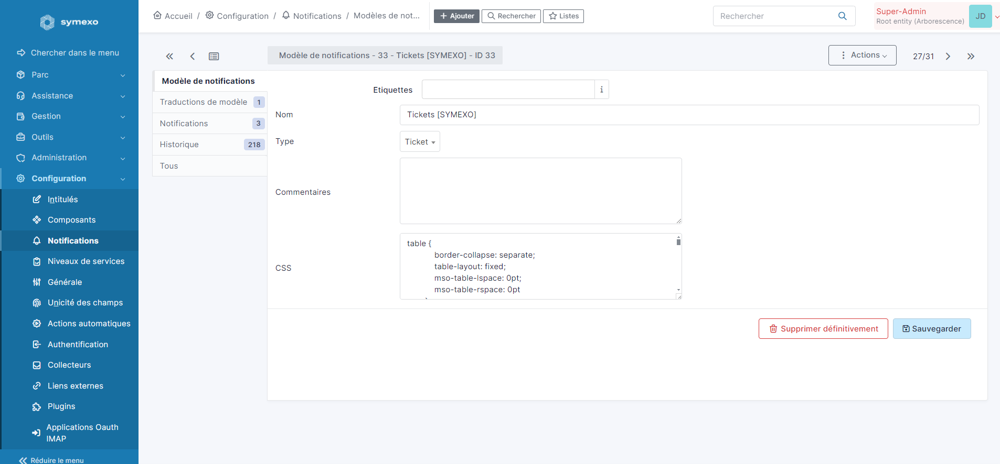
  <p>
    Voici l'interface qui va nous permettre de <b style="color: rgb(255, 149, 0)">modifier le modèle de notification sélectionné</b>, nous avons plusieurs options dans chaque menu ; ici nous pouvons lui donner un <b style="color: rgb(255, 149, 0)">nom</b>, le <b style="color: rgb(255, 149, 0)"> classer dans un type</b>, <b style="color: rgb(255, 149, 0)">insérer des commentaires</b> mais surtout du <b style="color: rgb(255, 149, 0)">CSS</b>, le langage qui va permettre de <b style="color: rgb(255, 149, 0)">donner un style à notre mail</b>. Aussi, nous avons un menu "Traduction de modèle" auquel nous allons nous intéresser ci-après.
  </p>
</div><br>

<div style="display: flex; align-items: flex-start;">
  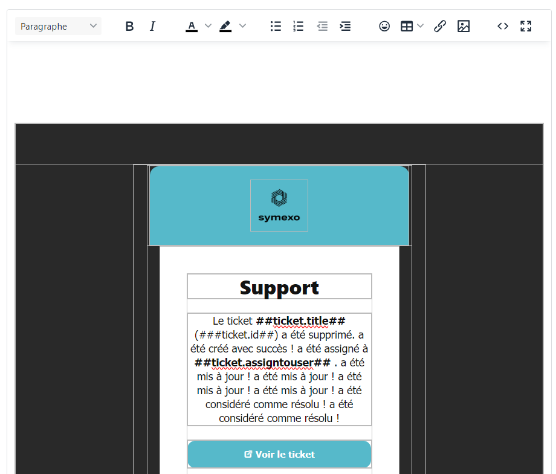
  
  <p>
    Ici, nous pouvons modifier tout ce qui est relatif à la <b style="color: rgb(255, 149, 0)">personnalisation du corps du mail</b> avec du language HTML. Cette petite interface va nous permettre de <b style="color: rgb(255, 149, 0)">mettre en forme le modèle</b> avec un éditeur intégré, avec lequel nous pouvons <b style="color: rgb(255, 149, 0)">insérer du texte</b>, des <b style="color: rgb(255, 149, 0)">tableaux</b>, <b style="color: rgb(255, 149, 0)">images</b>, <b style="color: rgb(255, 149, 0)">liens</b>, mais surtout <b style="color: rgb(255, 149, 0)">du code</b>. Personnellement je n'ai pas utilisé l'éditeur car celui-ci <b style="color: rgb(255, 149, 0)">n'est pas fidèle</b>, j'ai préféré tout faire en <b style="color: rgb(255, 149, 0)">code</b> et le tester directement sur <b style="color: rgb(255, 149, 0)">chrome</b>. Mais le tester sur chrome <b style="color: rgb(255, 149, 0)">limite seulement au visuel du mail</b>, et comme je vous l'ai dit, ce modèle va devoir <b style="color: rgb(255, 149, 0)">s'adapter à la situation</b> en changeant de visuel en fonction de l'état du ticket...
  </p>
</div><br>

<div style="display: flex; align-items: flex-start;">
  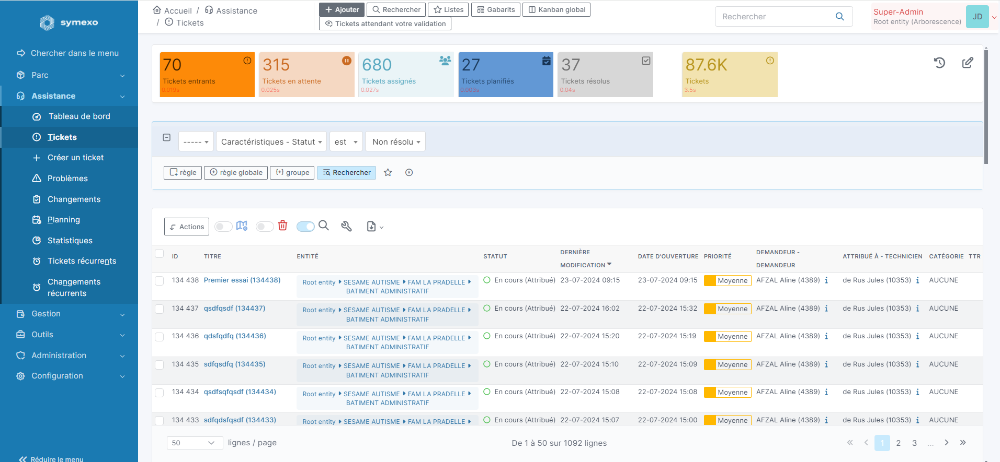
  <div>
    <p>
      C'est grâce à cette <b style="color: rgb(255, 149, 0)">magnifique interface</b> et au menu <b style="color: rgb(255, 149, 0)">"+ Créer un ticket"</b> que nous allons pourvoir <b style="color: rgb(255, 149, 0)">créer</b>, <b style="color: rgb(255, 149, 0)">gérer</b> et <b style="color: rgb(255, 149, 0)">attribuer des états</b> à nos différents tickets.
    </p>
    <div class="info-zone">  
      Sur un ticket, comme dit précédemment, nous avons plusieurs états : <b style="color: rgb(194, 194, 194)">Création</b>, <b style="color: rgb(194, 194, 194)">mise à jour</b>, <b style="color: rgb(194, 194, 194)">solution proposée</b>, <b style="color: rgb(194, 194, 194)">solution approuvée</b> et <b style="color: rgb(194, 194, 194)">clôture</b>.
    </div>
  </div>
</div><br>

<a name="FonctionnementGLPI"></a>

##### Introduction au fonctionnement des Modèles GLPI

Les modèles GLPI peuvent être universels grâce aux différentes variables que peut fournir GLPI, nous pouvons les reconnaître car elles sont entourées de deux hashtag **"##VARIABLE##"**, par exemple il y a **"##ticket.author##"** qui sera par la suite **remplacée par le nom de l'auteur du ticket**. Il y a aussi des **méthodes de conditions ou de boucle** telles que **"##IFticket.action=création du ticket##"** qui permet d'**exécuter le code suivant seulement si le ticket vient d'être créé** ou encore **"##FOREACHfollowups##"** qui va nous permettre d'**exécuter du code pour chaque suivi qui existe**, comme par exemple les afficher.
<br>

<a name="Modeles"></a>

##### Modèles

Comme dit précédemment, j'ai dû créer deux modèles, <a target="_blank" href="assets/files/tickets/Tickets [SYMEXO] clôture.html">un pour la clôture</a>, et <a target="_blank" href="assets/files/tickets/Tickets [SYMEXO].html">un pour le reste</a>. À la base, je ne voulais faire qu'un seul modèle pour des raisons de simplicité d'usage, mais seulement, la conditionnalité dans GLPI n'est pas au point, quand on met un **"##ELSE...##"** après un **"##IF...##"**, parfois ça ne marche pas et ça casse toutes les conditionnalités sous jacentes, pour cette raison, j'ai dû créer un modèle uniquement pour la clôture pour éviter une trop grande complexité de code dûe à la grande différence entre les deux.

- **Modèle Général**

<div style="display: flex; align-items: flex-start;">
  
  <div>
    <p>
      Dans ce <a target="_blank" href="assets/files/tickets/Tickets [SYMEXO].html">modèle classique</a>, nous avons toutes les actions à part la clôture qui y sont intégrés. Il y a 4 bulles principales, une contenant toutes les informations relatives au ticket, l'autre contenant le suivi, une la demande et enfin la dernière contient les informations de Symexo. Il ya plusieurs bulles de suivi car chacune correspond à une action en particulier.<br> Passons aux exemples :
    </p>
    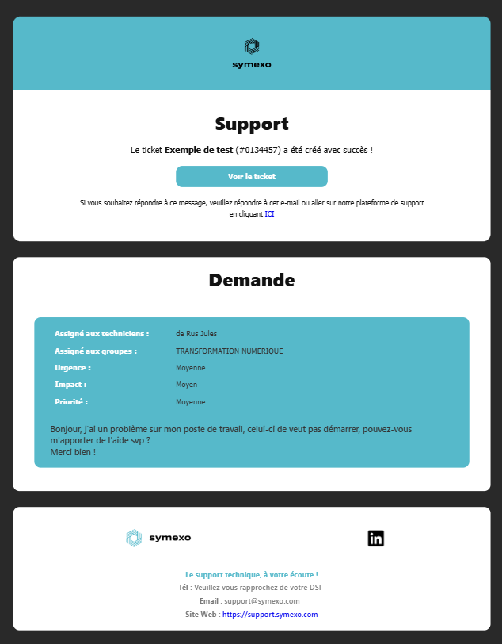
    <p>
      <a target="_blank" href="assets/files/tickets/1 - Ouverture du Ticket.html">Ici</a>, nous avons créé un ticket, nous avons 3 bulles, une avec les informations de celui-ci, un avec la demande de base et le dernier contenant les informations de Symexo.
    </p>
    
    <p>
      Quand un ticket est <a target="_blank" href="assets/files/tickets/2 - Suivi Technicien 1.html">mis à jour</a>, il génère un suivi, le suivi a 4 bulles, dans celle qui se rajoute (Suivi), nous avons répertorié tous les suivis de ticket.
    </p>
  </div>
</div><br>

<div style="display: flex; align-items: flex-start;">
  
  <div>
    <p>
      Quand il y a des messages de différentes personnes (<a target="_blank" href="assets/files/tickets/3 - Suivi Client 1.html">nouveau suivi</a>), ces messages sont différenciés par deux couleurs différentes, chacune attribuée à une personne. Nous pouvons aussi intégrer des images sans perte de qualité du suivi.
    </p>
    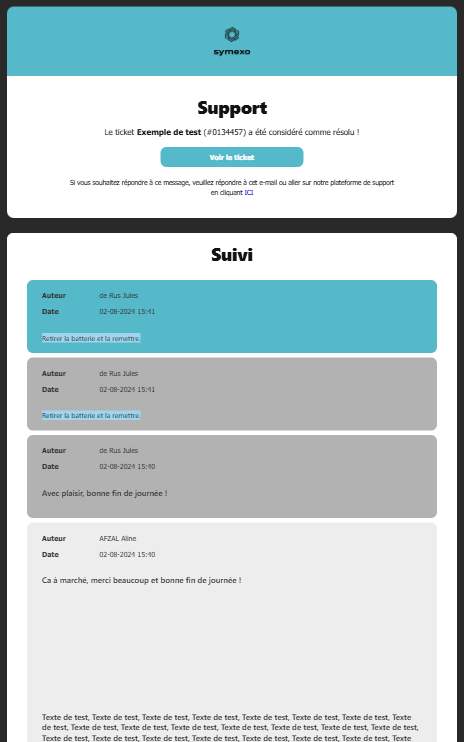
    <p>
      Quand une <a target="_blank" href="assets/files/tickets/7 - Solution Proposée.html">solution est proposée</a>, le texte dans la bulle "Support" change et la solution est dans une bulle bleue.
    </p>
  </div>
</div><br>

- **Modèle de Clôture**

<div style="display: flex; align-items: flex-start;">
  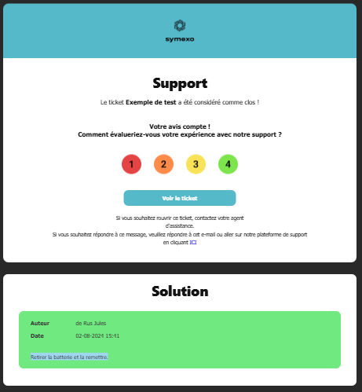
  <p>
    Quand un ticket est <a target="_blank" href="assets/files/tickets/8 - Clôture du Ticket.html">clôturé</a>, il change beaucoup : dans la bulle "Support", le texte change et une enquête de satisfaction est intégrée ; La bulle du dessous change de nom, maintenant c'est "Solution" et la solution approuvée est affichée dans une bulle verte.
  </p>
</div><br>

<a name="GenerationDocuments"></a>

#### Génération et valorisation automatique de Documents

Langages/Outils Utilisés | Utilité
-|-
Visiativ Process | Création de processus métier, remplissage de formulaire
JAVA | Récupération et manipulation des informations des formulaires pour générer des documents via Apache POI / Complétion automatique de champs de formulaires.

<a name="RefonteLogicielle"></a>
<br>

### Refonte de l'usine logicielle

Langages/Outils Utilisés | Description
-|-
<a href="src/HTML/RefonteUsineLogicielle/Bash.html" target="_blank">Bash</a> | Langage de manipulation du système informatique
<a href="src/HTML/RefonteUsineLogicielle/Yaml.html" target="_blank">YAML</a> | Langage de configuration
<a href="src/HTML/RefonteUsineLogicielle/Docker.html" target="_blank">Docker</a> | Plateforme permettant de créer, déployer et gérer des conteneurs légers et isolés, qui regroupent une application et ses dépendances
<a href="src/HTML/RefonteUsineLogicielle/Portainer.html" target="_blank">Portainer</a> | Interface graphique de gestion d'environnements Docker complet (Images, Conteneurs, Stacks, Volumes, Network)
<a href="src/HTML/RefonteUsineLogicielle/Gitea.html" target="_blank">Gitea</a> | Plateforme de gestion de code source légère et auto-hébergée
<a href="src/HTML/RefonteUsineLogicielle/GiteaActions.html" target="_blank">Gitea Actions</a> | Fonctionnalité de Gitea permettant l'automatisation de <a href="src/HTML/RefonteUsineLogicielle/Workflow.html" target="_blank">workflows</a> de développement directement au sein de la plateforme
<a href="src/HTML/RefonteUsineLogicielle/NginxProxyManager.html" target="_blank">Nginx Proxy Manager</a> | Interface graphique permettant de gérer des serveurs proxy basés sur Nginx
<a href="src/HTML/RefonteUsineLogicielle/SonarQube.html" target="_blank">SonarQube</a> | Plateforme d'analyse de code qui permet de mesurer la qualité du code source et de détecter des problèmes tels que des bugs, des vulnérabilités et des mauvaises pratiques de programmation
<a href="src/HTML/RefonteUsineLogicielle/SonatypeNexusRepositoryManager.html" target="_blank">Sonatype Nexus Repository Manager</a> | Outil de gestion de dépôts de composants logiciels. Il permet de stocker, gérer et distribuer des artefacts logiciels comme des bibliothèques, des dépendances, et des images de conteneurs

Dans le **service de transformation numérique**, pour développer des applications ou autre, nous avons une usine logicielle, un regroupement de logiciels qui fonctionnent ensemble pour nous simplifier la vie (comme un **écosystème**)... C'est à dire, quand nous envoyons notre code sur **Gitea**, celui-ci est envoyé sur **Jenkins** qui est un logiciel qui permet de le **déploiement du code sur Sonarqube et Archiva** (similaire à Nexus Repository Manager). Donc dans l'ancienne usine logicielle nous utilisions les logiciels suivants : Gitea, Jenkins, Sonarqube, Archiva.

Aujourd'hui, nous avons choisi **d'abandonner certains logiciels pour d'autre**, nous utilisons maintenant : Gitea, Gitea actions (fonctionnalité de Gitea), Sonarqube et Sonatype Nexus Repository Manager. Nous avons donc abandonné **Jenkins** pour les **Gitea action** et **Archiva** pour **Nexus Repository**.

Pour faire en sorte que l'écosystème prenne moins de performances et qu'il soit plus facile à gérer, nous avons tout dockerisé, chaque application est contenue dans un conteneur docker, certains peuvent communiquer entre eux comme par exemple celui des Gitea Actions et de SonarQube.

##### Pourquoi abandonner ces logiciels ?

###### Jenkins

Nous avons remplacé Jenkins par les Gitea actions car tout ce que nous avons besoin de faire sur Jenkins (vérifier la compilation et envoyer le code sur Sonarqube et Nexus Repository), nous pouvons le faire avec les Gitea action, pour retirer de la complexité à l'écosystème et économiser en performances ; nous avons choisi de l'abandonner.


###### Archiva

Archiva n'était tout simplement pas un logiciel que nous pouvions dockeriser, de plus, il est compliqué à mettre à jour et pas très intuitif ni esthétique. Sonatype Nexus, lui, est dockerisable, ce qui fait qu'il est beaucoup plus facile à gérer, de plus il est très intuitif et plutôt joli.


##### Pourquoi tout dockeriser ?

Dockeriser l'usine logicielle nous a permis de gagner en portabilité, en facilité de gestion, en sécurité et en performance. Vu que les applications sont portées dans des conteneurs, nous pouvons à tout moment les arrêter et les changer de place grâce à la stack qui le précède. Le logiciel Diun va pouvoir nous prévenir dès qu'une mise à jour est disponible sur une application, ce qui fait gagner beaucoup de temps car quand nous voulons mettre à jour une application, nous n'avons qu'à redémarrer son conteneur ! De plus, toutes les données sont stockées dans des volumes inaccessibles par les applications non autorisées ou non liées, ce qui garantit la sécurité des données de l'application. Enfin, vu que chaque application est exécutée dans un conteneur sans OS, cela est beaucoup moins énergivore ; chaque conteneur contient seulement ce dont l'application a besoin pour fonctionner, économisant ainsi beaucoup de performances !

<a name="LogicielsPrealables"></a>

#### Logiciels préalables

Pour faire fonctionner tout cet écosystème correctement et rendre une bonne expérience utilisateur, nous devons faire en sorte de simplifier l'accès aux outils, de les sécuriser et de les optimiser ; Pour cela, nous avons utilisé Docker, Portainer et Nginx Proxy Manager.

##### <a href="src/HTML/RefonteUsineLogicielle/Docker.html" target="_blank">Docker</a>

<a href="src/HTML/RefonteUsineLogicielle/Docker.html" target="_blank">Docker</a>, comme vu précédemment, est un outil de conteneurisation de logiciel, il permet d'exécuter chaque logiciels indépendamment avec d'installé seulement ce que le logiciel à besoin, ce qui optimise la consommation de ressource par logiciels. De plus, il sécurise chaque applications car, sauf si elles y sont autorisées, elles ne peuvent pas communiquer ensemble ; Aussi, chaque applications ont leurs volumes personnels dans lesquels elles vont pouvoir stocker toutes leur données, ce qui simplifie la gestions de celles-ci.


##### <a href="src/HTML/RefonteUsineLogicielle/Portainer.html" target="_blank">Portainer</a>

<a href="src/HTML/RefonteUsineLogicielle/Portainer.html" target="_blank">Portainer</a> est un outil permettant de centraliser et de gérer tout un environnement docker (stacks (compose), images, conteneurs, volumes, networks) dans une application Web graphique et intuitive. C'est le deuxième logiciel de base à installer après docker pour que notre usine logicielle fonctionne correctement. D'ailleurs, ce logiciel tourne aussi dans un conteneur !

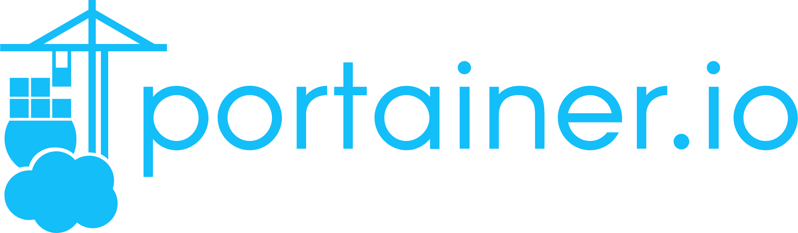

##### <a href="src/HTML/RefonteUsineLogicielle/NginxProxyManager.html" target="_blank">Nginx Proxy Manager</a>

<a href="src/HTML/RefonteUsineLogicielle/NginxProxyManager.html" target="_blank">Nginx Proxy Manager</a> nous a permis de rendre l’expérience utilisateur plus agréable, mais surtout plus sécurisée. Grâce à ce logiciel, à un DNS configuré  précédemment et un certificat SSL valide, nous avons pu donner à notre application web à laquelle nous pouvions de base accéder via son ip, un nom de domaine ! Par exemple, pour accéder à Gitea, au lieu d'aller sur http://10.2.1.70:3000 *(adresse IP factice)* nous pouvions aller sur https://code-repo.symexo.com, de même pour SonarQube : https://code-quality.symexo.com et enfin pour Nexus Repository : https://code-artifacts.symexo.com. Aussi, grâce au proxy, les applications seront protégées des attaques directes, celui-ci jouera le role du garde de la porte vers chaque applications, personne ne pourra directement accéder à celles-ci. Ce logiciel est à configurer en suivant de l'installation de Gitea, SonarQube et Nexus Repository.


<a name="LogicielsPrincipaux"></a>

#### Logiciels principaux

##### <a href="src/HTML/RefonteUsineLogicielle/Gitea.html" target="_blank">Gitea</a>

<a href="src/HTML/RefonteUsineLogicielle/Gitea.html" target="_blank">Gitea</a> est un instance de Git parmi tant d'autres, nous pouvons par exemple la comparer à GitHub ou à GitLab ou même à BitBucket. La raison pour laquelle nous l'avons choisi est que ce logiciel est open source et que nous pouvons l'héberger en local, ce qui garanti une sécurité de nos données et de celles nos clients ; Aussi, nous ne dépendons pas d'internet, tout ce que nous avons besoin pour travailler est un réseau local fonctionnel.


##### <a href="src/HTML/RefonteUsineLogicielle/SonarQube.html" target="_blank">SonarQube</a>

<a href="src/HTML/RefonteUsineLogicielle/SonarQube.html" target="_blank">SonarQube</a> est un outil de vérification de qualité de code, via des algorithmes propres à chaque langage, il va déterminer la qualité (soit la complexité, les mauvaises pratique, la duplication de code et les bugs/vulnérabilités potentiels) de celui-ci. Une fois les vérifications faites, grâce à l’extension "SonarLint" disponible sur VsCode, il va nous avertir des différents problèmes que nous pourrions résoudre dans notre code. C'est vraiment un très bon outil pour continuer à fournir un code de qualité à nos clients !


##### <a href="src/HTML/RefonteUsineLogicielle/SonatypeNexusRepositoryManager.html" target="_blank">Sonatype Nexus Repository Manager</a>

<a href="src/HTML/RefonteUsineLogicielle/SonatypeNexusRepositoryManager.html" target="_blank">Sonatype Nexus Repository Manager</a> est un espace de stockage des artefacts que va produire votre code, que ce soit les librairies (.jar/.a) ou les fichiers de configuration (xml/.h). Nous avons créer sur ce logiciel un groupe symexo contenant un dépôt "Proxy" qui va nous permettre d'aller chercher les dépendances sur un dépôt en ligne définit si celles-ci ne sont pas disponible dans les autres dépôts du groupe. En ce qui concerne les dépôts locals, nous en avons configurer deux, un pour les releases et un pour les snapshots.


<a name="DeroulementInstallation"></a>

#### Déroulement de l'installation

<a name="VM"></a>

##### Machine virtuelle

Avant toute chose, toute installation de logiciels, mon collègue à dû configurer une machine virtuelle sur VMware pour héberger toutes les applications. Celle-ci tourne sous Debian 12 sans interface graphique et nous lui avions de base allouer 4vCPU et 8Go de RAM, cependant, durant les tests des différents logiciel nous avons dû la faire évoluer...

<a name="Docker"></a>

##### Docker

Nous avons ensuite installer Docker, celui-ci est absolument nécessaire au bon fonctionnement de notre usine, sans lui il n'y a rien.
Pour l'installer nous avons suivis les étapes suivantes :

- installer le **dépôt apt Docker**, celui-ci va nous permettre d'exécuter toutes les commandes docker disponible
- Installation de la dernière version des paquets Docker
- Vérification d'installation en exécutant l'image **hello-world**
Cette commande nous a installer une image de test et l'a exécuté dans un conteneur. Quand celui-ci s'est exécuté, il nous a affiché un message de confirmation et s'est arrêté.

<p class="info-note">Les détails de code sont disponible dans la documentations associée <a href="src/HTML/RefonteUsineLogicielle/Docker.html" target="_blank">ici</a></p>

<a name="Portainer"></a>

##### Portainer

Une fois que docker à été installé, nous avons pu installer Portainer pour installer, configurer et gérer tous nos futur conteneurs depuis une interface graphique.
Pour l'installer nous avons tout simplement eu à entrer une commande docker :

```bash
docker run -d -p 9000:9000 --name portainer \
    --restart=always \
    -v /var/run/docker.sock:/var/run/docker.sock \
    -v portainer_data:/data \
    portainer/portainer-ce:latest
```

<p class="info-zone">Cette commande va lancer un conteneur se nommant "portainer" exposant le port 9000 en se basant sur l'image "portainer/portainer-ce:latest" et stoquant ses informations dans le volume "/data" du conteneur et "/portainer_data" sur votre machine !</p>
<p class="info-note">Pour de plus précises informations vous pouvez aller voir la <a href="src/HTML/RefonteUsineLogicielle/Portainer.html" target="_blank">documentation associée</a></p>

L'interface graphique ce présente sous cette forme :

<div style="display: flex; align-items: flex-start;">
  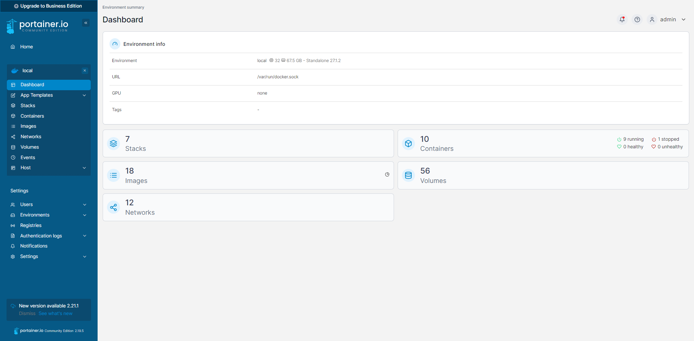
  <p>Avec cette interface nous pouvons accéder simplement à tous les composants de notre environnement docker, les éditer, les déployer, les stopper, les supprimer et encore bien d'autres actions...</p>
</div>

<a name="Gitea"></a>

##### Gitea

- Maintenant que Portainer à été installé, nous avons pu installer Gitea directement avec un interface graphique simple. Nous n'avons qu'à créer une stack et à la remplir avec le code ci-dessous et à compléter toutes les variables, ensuite nous la déployons et voilà, il est installé !

```bash
version: "3"

networks:
  gitea:
    external: false

services:
  server:
    image: gitea/gitea:latest
    container_name: gitea
    environment:
      - USER_UID=1000
      - USER_GID=1000
      - GITEA__database__DB_TYPE=mysql
      ...
      - GITEA__log__LEVEL=Error
      - GITEA__indexer_REPO_INDEXER_ENABLED=true
    restart: always
    networks:
      - gitea
    volumes:
      - ./gitea:/data
      - /etc/timezone:/etc/timezone:ro
      - /etc/localtime:/etc/localtime:ro
    ports:
      - "3000:3000"
      - "8443:443"
      - "222:22"
    depends_on:
      - db

  db:
    image: mysql:8
    restart: always
    environment:
      - MYSQL_ROOT_PASSWORD=gitea
      - MYSQL_USER=gitea
      - MYSQL_PASSWORD=gitea
      - MYSQL_DATABASE=gitea
    networks:
      - gitea
    volumes:
      - ./mysql:/var/lib/mysql
```

<p class="info-zone">Dans ce compose, nous instancions une image et un conteneur Gitea et un sql8 pour stocker les configuration, les dépôts et les utilisateur que nous créerons plus tard dans Gitea. Toutes les variables sont optionnelles, nous les avons mise car notre configuration les demande.</p>

<p class="info-note">Des précisions supplémentaires sont disponibles dans la documentation associée, vous pouvez y accéder en cliquant <a href="src/HTML/RefonteUsineLogicielle/Gitea.html" target="_blank">ici</a> !</p>

- Ensuite, j'ai du finir la configuration : au premier accès sur l'application, il y a une page de vérification de la configuration, une fois cette configuration validée, je me suis créer un compte qui a directement eu les droits d'administrateur.
- Après avoir fini de configurer Gitea, j'ai dû enregistrer ma clé SSH pour pouvoir envoyer du code dessus.

<div style="display: flex; align-items: flex-start;">
  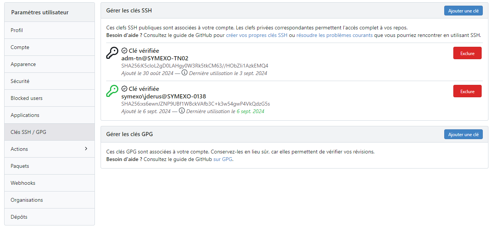
  <div>
    <p>C'est dans ce menu que j'ai pu configurer ma clé SSH</p>
    <p class="info-zone">Pour plus d'informations, vous pouvez vous rendre sur la <a href="src/HTML/RefonteUsineLogicielle/Gitea.html">documentation associée</a></p>
  </div>
</div>

<a name="GiteaActions"></a>

##### Gitea Actions

Les Gitea actions sont une fonctionnalité de Gitea permettant de faire du "CI/CD" (intégration continue/livraison ou déploiement continu), en bref ça va nous permettre de faire un peu ce qu'on veut avec notre code une fois qu'il est envoyé sur Gitea, que ce soit test de compilation, test classique ou encore envoi sur différentes plateformes, beaucoup de choses sont possible.
<p class="info-zone">Pour plus de précisions vous pouvez aller regarder la documentation associée en cliquant <a href="src/HTML/RefonteUsineLogicielle/GiteaActions.html">ici</a> !</p>

Pour faire l'installation, j'ai dû suivre les étapes suivantes :

- J'ai choisi de créer un conteneur à part pour le runner des Gitea Actions car si celui-ci est saturé au niveau des performances, je pourrai continuer à me servir de Gitea. Pour la création j'ai mis le compose suivant :

```yaml
version: "3.8"
services:
  runner:
    image: gitea/act_runner:latest
    deploy:
      resources:
        limits:
          cpus: "16"
          memory: "32g"
    environment:
      CONFIG_FILE: /config.yaml
      GITEA_INSTANCE_URL: "http://10.2.1.70:3000"
      GITEA_RUNNER_REGISTRATION_TOKEN: "${TOKEN}"
      GITEA_RUNNER_NAME: "PortainerRunner"
      GITEA_RUNNER_TYPE: "instance"
    volumes:
      - ./config.yaml:/config.yaml
      - ./data:/data
      - /var/run/docker.sock:/var/run/docker.sock
      - /var/lib/docker/volumes/m2Directory:/mnt
```

<p class="info-zone">Ici, j'ai limité l'utilisation CPU et RAM à 16cpus et 32Go pour ne pas saturer le reste du système en cas de trop grosse consommation de performances.</p>

<br>
<div style="display: flex; align-items: flex-start;">
  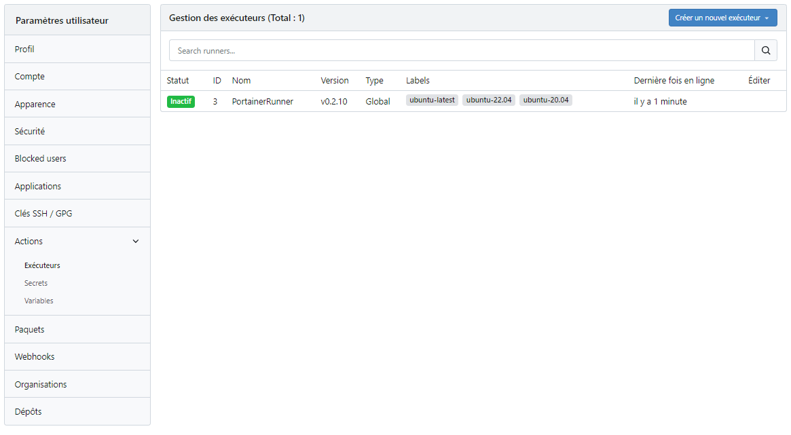
  <p class="info-zone"> Pour récupérer le token j'ai dû me rendre dans le menu des exécuteurs sur Gitea et le récupérer en cliquant sur "Créer un nouvel exécuteur". Tout est détaillé sur la <a href="src/HTML/RefonteUsineLogicielle/Gitea.html">documentation</a> tout en bas.</p>
</div>
<br>

- Ensuite je suis rentré dans le conteneur et j'ai configurer tout le nécessaire pour que le workflow fonctionne correctement puis j'en suis sorti.
<p class="info-note">Pour plus de détails sur comment je m'y suis pris, vous pouvez aller vous la <a href="src/HTML/RefonteUsineLogicielle/Gitea.html">documentation associée</a>, la partie consacrée à la configuration des Gitea Action se trouve tout en bas.</a></p>

Malheureusement j'ai eu un petit problème...
Le Runner, à son premier lancement, regarde s'il n'y a pas un fichier de configuration à sa racine, sinon il en crée un ; Mais quand il le crée, souvent il crée un répertoire au lieu d'un fichier, ce qui fait que quand il essaie de l'ouvrir en tant que fichier, il n'y arriver pas. J'ai donc dû arrêter le conteneur, remplacer ce dossier par un fichier du même nom et relancer le conteneur.

- Une fois le runner correctement configuré, je me suis rendu dans mon dépôt et je suis allé dans les paramètres de celui-ci pour autoriser les Action sur celui-ci, une fois cela fait, j'ai pu créer mon premier workflow, le commit et laisser la magie opérer !

<a name="SonarQube"></a>

##### SonarQube

Après Gitea j'ai directement pu installer SonarQube, c'est à peu près le même principe que Gitea sauf que c'est plus simple, il n'y a eu à faire quasiment aucune configuration, j'ai juste dû créer la stack avec le compose ci-dessous, la déployer puis aller chercher le token SonarQube.

```yaml
version: "3"

services:
  sonarqube:
    image: sonarqube:community
    depends_on:
      - db
    environment:
      SONAR_JDBC_URL: jdbc:postgresql://db:5432/sonar
      SONAR_JDBC_USERNAME: sonar
      SONAR_JDBC_PASSWORD: sonar
    volumes:
      - sonarqube_data:/opt/sonarqube/data
      - sonarqube_extensions:/opt/sonarqube/extensions
      - sonarqube_logs:/opt/sonarqube/logs
    ports:
      - "5000:9000"
  db:
    image: postgres:12
    environment:
      POSTGRES_USER: sonar
      POSTGRES_PASSWORD: sonar
    volumes:
      - postgresql:/var/lib/postgresql
      - postgresql_data:/var/lib/postgresql/data

volumes:
  sonarqube_data:
  sonarqube_extensions:
  sonarqube_logs:
  postgresql:
  postgresql_data:
```

<p class="info-zone">Dans ce compose, j'ai instancier une image et un conteneur SonarQube et un Postgres12 pour stocker les utilisateur et le code envoyé.</p>

- Après avoir déployer le logiciel, j'ai dû aller chercher le token d'enregistrement dans SonarQube dans cette petite fenêtre :

<br>
<div style="display: flex; align-items: flex-start;">
  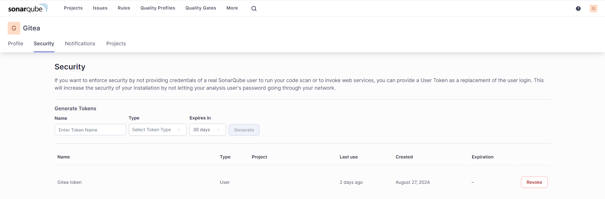
  <p class="info-zone">Dans cette fenêtre, j'ai pu créer mon token en renseignant le nom, le type et le temps d'expiration de celui-ci</p>
</div>
<br>

- Au final j'ai pu envoyer mon code sur SonarQube et voir les différents comptes rendus !

<br>
<div style="display: flex; align-items: flex-start;">
  
  
  Et comme mon code est parfait, il n'y a aucun problème :) (Si seulement c'était le miens...)
</div>
<br>

<p class="info-note">Si vous souhaitez avoir plus de détails, la documentation associée est <a href="src/HTML/RefonteUsineLogicielle/SonarQube.html">ici</a> !</p>

<a name="Nexus"></a>

##### Sonatype Nexus Repository

Pour Nexus Repository, c'est tout pareil sauf que quand on se connecte pour la première fois, il faut aller chercher le mot de passe à un endroit spécifique sur le système...

- Premièrement j'ai installé SonarQube avec le compose ci-dessous, pour une fois il est très simple !

```yaml
version: "3"
services:
  nexus:
    image: sonatype/nexus3
    restart: always
    volumes:
      - "nexus-data:/sonatype-work"
    ports:
      - "8081:8081"
      - "8085:8085"
volumes:
  nexus-data: {}
```

<p class="info-zone">Dans ce compose, j'ai instancier une image et un conteneur Sonatype Nexus 3 pour stocker les utilisateurs et les artefacts que j'y envoie.</p>

- Une fois le logiciel lancé, il faut se connecter, et quand on se connecte pour la première fois il faut aller chercher le mot de passe  un endroit spécifique sur le système (conteneur). Pour cela j'ai dû entrer dans le conteneur et aller chercher le mot de passe au bon emplacement.


- Quand je me suis connecté, je suis allé créer plusieurs choses :
  - Un dépôt "releases" qui va me permettre de stocker seulement les versions finies.
  - Un dépôt "snapshots" qui va me permettre de stocker toutes les versions de test.
  - Un dépôt "Proxy", celui-ci va se charger d'aller chercher les dépendances sur un dépôt en ligne si celle que je demande ne sont pas dans le dépôts du groupe
  - Un groupe dans lequel j'ai mis les 3 dépôts précédents.


<br>
<br>

<p class="info-note">Si vous souhaitez avoir plus d'informations, vous pouvez aller voir la <a href="src/HTML/RefonteUsineLogicielle/SonatypeNexusRepositoryManager.html">documentation liée</a>.</p>

<a name="ApresInstallation"></a>

#### Après installation

Une fois toute l'installation terminée et tous les logiciels fonctionnels, j'ai pu commencer à tester tout l'écosystème, pour cela j'ai créer un Workflow Gitea qui va faire tout un tat de choses avec le code push sur Gitea.

<a name="Workflow"></a>

##### Workflow Gitea

Le Workflow va permettre d'exécuter différents test, de stocker et d'analyser le code :

- À la réception du code, il va exécuter des tests de compilation et d'autres test s'ils sont paramétrés
- Une fois les tests effectués, si ceux-ci ont réussis, les artefacts seront envoyés sur Nexus Repository.
- Ensuite, encore une fois si les test ont réussis, tout le code sera envoyé sur SonarQube pour une analyse de la qualité de celui-ci.

<br>
<p class="info-note">Pour avoir plus d'informations sur le Workflow que j'ai écris, vous pouvez vous rendre sur sa <a href="src/HTML/RefonteUsineLogicielle/WorkflowGitea.html">documentation associée</a>.</p>
<br>


<a name="FonctionnementEcosysteme"></a>

##### Fonctionnement de l'écosystème

<br>

<br>

1) Le code est **Push sur Gitea**
2) Celui-ci passe par les **Gitea Actions**, un Workflow s'exécute et :
   - Vérifie la **compilation du Code**
   - **Exécute les test** si ceux-cis sont paramétrés
3) Si le build et les tests sont passés, le Workflow passe à l'étape suivante et :
   - **Envoie les artefacts sur Sonatype Nexus Repository Manager**
   - **Envoie le code sur SonarQube** pour une analyse de qualité de code

<a name="ProblemesUsineV2"></a>

##### Problèmes rencontrés

Pour cette mission je n'ai pas rencontré beaucoup de problèmes, le seul que j'ai rencontré est au niveau de la configuration des Gitea Action:
Quand le conteneur de l'action runner se lance, il va chercher un fichier **"config.yaml"**, s'il ne le trouve pas, il va le créer, sauf que souvent il va créer un dossier au lieu d'un fichier, donc j'ai du arrêter le conteneur, remplacer le dossier par un fichier du même nom et le redémarrer.

<a name="ConclusionUsineV2"></a>

#### Conclusion

Cette mission n'était pas extrêmement difficile mais m'a beaucoup plu. J'ai pu développer des compétences plutôt solides en Dev-Ops, surtout sur docker et les Gitea actions, et tout ça en utilisant le langage **YAML** pour installer et configurer beaucoup de logiciels d'analyse, de stockage, de test et d'autres. Nous avons maintenant une Usine Logicielle plus performante et à jour !

<a name="AutresMissions"></a>

### Autres missions
