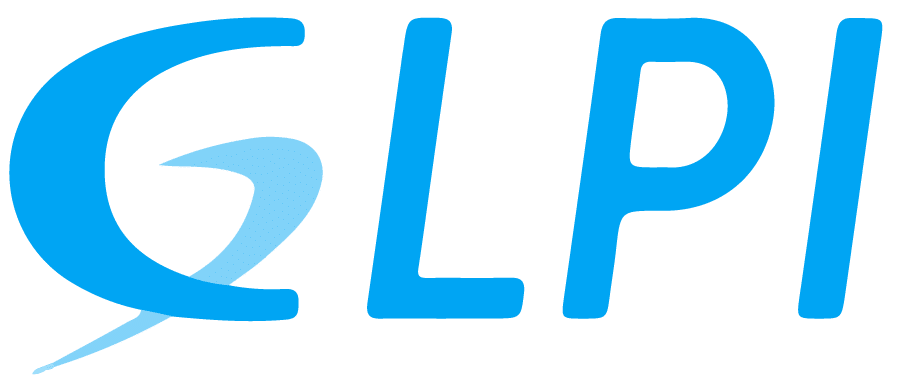

@import "../../../style/styles_epitech_stage.less"

# Qu'est-ce que c'est ?

GLPI (Gestion Libre de Parc Informatique) est un logiciel open-source de gestion des services informatiques (ITSM) et de gestion des actifs informatiques (ITAM).

## Ça sert à quoi ?

Il permet aux organisations de gérer efficacement leurs infrastructures informatiques, leurs ressources matérielles et logicielles, ainsi que les processus liés aux services informatiques.

#### Gestion des actifs (IT Asset Management ITAM) :

GLPI permet de gérer le parc informatique, en inventoriant tout le matériel informatique (ordinateurs, serveurs, périphériques, etc.), les 
logiciels installés, et les licences. Il facilite le suivi du cycle de vie des équipements (installation, maintenance, remplacement).

#### Gestion des incidents et des demandes (Helpdesk) :

GLPI offre un système de ticketing qui permet de gérer les demandes d'assistance et les incidents techniques. Les utilisateurs peuvent créer des tickets, et les équipes techniques peuvent suivre leur progression, les prioriser, et les résoudre.

#### Gestion des changements (Change Management) :

Il permet de planifier et de suivre les changements apportés à l'infrastructure informatique, en assurant un suivi des risques et des impacts potentiels.

#### Base de connaissances :

Les équipes peuvent créer et maintenir une base de connaissances, qui contient des articles et des solutions pour résoudre les problèmes courants.

#### Gestion des contrats et des fournisseurs :

GLPI permet de gérer les contrats (maintenance, licences, garanties) et de suivre les relations avec les fournisseurs.

#### Rapports et tableaux de bord :

Le logiciel offre des outils de reporting pour analyser l'état des actifs informatiques, les performances du service technique, les coûts, etc.

#### Plugins et personnalisation :

GLPI est extensible avec de nombreux plugins, permettant d’ajouter des fonctionnalités spécifiques comme la gestion de la relation client (CRM), la gestion des projets, l’intégration avec d’autres outils, etc.

### Au final...

GLPI sert à :

- Gérer le parc informatique d'une organisation (matériel et logiciel).
- Suivre et résoudre les incidents techniques via un système de tickets.
- Planifier et suivre les évolutions de l'infrastructure informatique.
- Offrir des outils d’aide à la décision grâce aux rapports et aux analyses.

Il est particulièrement utile pour les services informatiques souhaitant optimiser la gestion de leur infrastructure et améliorer l'efficacité de leurs opérations.
