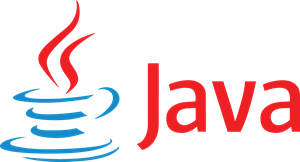

@import "../../../style/styles_epitech_stage.less"

# Qu'est-ce que c'est ?

Le Java est un langage de programmation orienté objet créé par Sun Microsystems en 1995 et désormais maintenu par Oracle Corporation.  Il est très populaire en raison de sa portabilité, de sa simplicité et de sa robustesse.

## Ça sert à quoi ?

#### Java est utilisé dans de nombreux domaines et pour diverses applications :

- Applications d'entreprise : Java est très répandu dans le développement d'applications d'entreprise. Les grandes entreprises utilisent souvent Java pour construire des systèmes robustes et évolutifs grâce à des frameworks comme Spring et Hibernate.
- Développement mobile : Android, le système d'exploitation mobile le plus utilisé dans le monde, est principalement basé sur Java. De nombreuses applications Android sont développées en Java (même si Kotlin, un autre langage, est devenu très populaire).
- Applications Web : Java est largement utilisé pour développer des applications Web grâce à des technologies comme JavaServer Pages (JSP), Servlets, et des frameworks comme Spring MVC. Il est souvent utilisé pour créer des sites dynamiques et des services web.
- Logiciels de bureau : Java est également utilisé pour développer des applications de bureau grâce à des bibliothèques comme JavaFX ou Swing.
- Systèmes embarqués : De par sa portabilité, Java est également utilisé dans des systèmes embarqués, tels que des appareils électroniques, des cartes à puce ou des décodeurs.
- Jeux vidéo : Bien que moins fréquent que d'autres langages comme C++ pour le développement de jeux, Java est utilisé dans certains jeux, notamment pour les jeux mobiles.

#### Pourquoi choisir Java ?

- Fiabilité et maturité : Java est utilisé depuis des décennies et bénéficie d'une communauté active et d'une multitude de ressources.
- Multithreading : Java permet l'exécution de plusieurs tâches en parallèle, ce qui est important pour les applications modernes qui nécessitent des performances élevées.
- Écosystème riche : Avec ses frameworks et outils, Java facilite le développement de divers types d'applications.

#### Pourquoi c'est cool ?

- Portabilité : Le Java est conçu pour être indépendant des plateformes. Grâce à la machine virtuelle Java (JVM), un programme écrit en Java peut être exécuté sur n'importe quel système d'exploitation (Windows, macOS, Linux, etc.) sans modification. Le slogan « Write Once, Run Anywhere » (écrire une fois, exécuter partout) reflète cet avantage.
- Orienté objet : Java suit le paradigme de la programmation orientée objet, facilitant ainsi la réutilisation du code, la modularité et l'organisation des programmes.
- Sécurité : Java est conçu pour éviter les failles de sécurité courantes, notamment celles liées à la gestion de la mémoire. Il intègre un système de sécurité robuste pour les applications, notamment les applets exécutées dans un navigateur.
- Gestion automatique de la mémoire : Java utilise un mécanisme appelé ramasse-miettes (Garbage Collector), qui gère automatiquement la mémoire en libérant les ressources inutilisées, ce qui simplifie le travail du développeur.
- Bibliothèques et API riches : Java est livré avec un large éventail de bibliothèques et d'API, permettant de développer facilement des applications graphiques, des programmes de réseau, de manipulation de fichiers, etc.

### Au final...

En résumé, Java est un langage polyvalent, utilisé pour créer une grande variété d'applications, des systèmes d'entreprise aux applications mobiles, en passant par les applications Web.