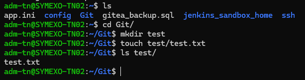

@import "../../../style/styles_epitech_stage.less"

# Qu'est-ce que c'est ?

Le Bash (Bourne Again SHell) est un interpréteur de commandes pour les systèmes d'exploitation de type Unix, tels que Linux et macOS.

## Ça sert à quoi ?

C'est un programme qui permet d'interagir avec le système via des lignes de commande en tapant des instructions. Bash est également un langage de script, permettant d'automatiser des tâches en écrivant des scripts.

### Exemples

- Lister des fichiers dans un répertoire

```bash
ls
```

- Changer de répertoire

```bash
cd /chemin/du/repertoire
```

- Créer un fichier vide et un dossier

```bash
touch fichier.txt

mkdir mon_dossier
```

Une combinaison de toutes ces commandes pourrait donner ça :



## Scripts ?

Un script est un fichier texte contenant une série de commandes qui sont exécutées de manière séquentielle par un interpréteur, comme Bash ou Python. Il permet d'automatiser des tâches répétitives ou complexes. Au lieu de taper manuellement plusieurs commandes, on peut les regrouper dans un script, qui les exécute toutes d'un coup.

### Exemples

- Script pour créer une sauvegarde de fichiers :
Ce script copie tous les fichiers d'un dossier dans un dossier de sauvegarde.

```bash
#!/bin/bash

# Chemin du répertoire source et de la sauvegarde
SOURCE="/home/utilisateur/dossier"
BACKUP="/home/utilisateur/sauvegarde"

# Affiche un message d'information
echo "Sauvegarde des fichiers depuis $SOURCE vers $BACKUP"

# Crée une copie des fichiers
cp -r $SOURCE/* $BACKUP/

# Message de fin
echo "Sauvegarde terminée."
```

- Script pour vérifier l'utilisation du disque :
Ce script affiche l'espace disque disponible et envoie une alerte si l'utilisation dépasse 80 %.

```bash
#!/bin/bash

# Vérifie l'utilisation du disque
UTILISATION=$(df / | grep / | awk '{ print $5 }' | sed 's/%//g')

# Si l'utilisation est supérieure à 80 %, affiche une alerte
if [ $UTILISATION -gt 80 ]; then
  echo "Alerte : l'utilisation du disque est de $UTILISATION %"
else
  echo "Tout va bien : l'utilisation du disque est de $UTILISATION %"
fi
```

- Script pour renommer des fichiers en série :
Ce script renomme tous les fichiers dans un répertoire en leur ajoutant un préfixe.

```bash
#!/bin/bash

# Chemin du répertoire à traiter
REPERTOIRE="/home/utilisateur/fichiers"

# Parcourt tous les fichiers du répertoire
for fichier in $REPERTOIRE/*; do
  # Ajoute un préfixe "ancien_" à chaque fichier
  mv "$fichier" "$REPERTOIRE/ancien_$(basename $fichier)"
done

echo "Renommage terminé."
```

### Avantage d'utiliser des scripts

- Automatisation : Un script permet d'automatiser des tâches répétitives comme la gestion de fichiers, la surveillance de serveurs, ou des - sauvegardes de données.
- Gain de temps : En regroupant des commandes dans un script, l'utilisateur peut exécuter des séries d'opérations complexes d'un seul coup.
- Personnalisation : Les scripts peuvent être adaptés à des besoins spécifiques, par exemple pour des tâches précises liées à l'administration système.
